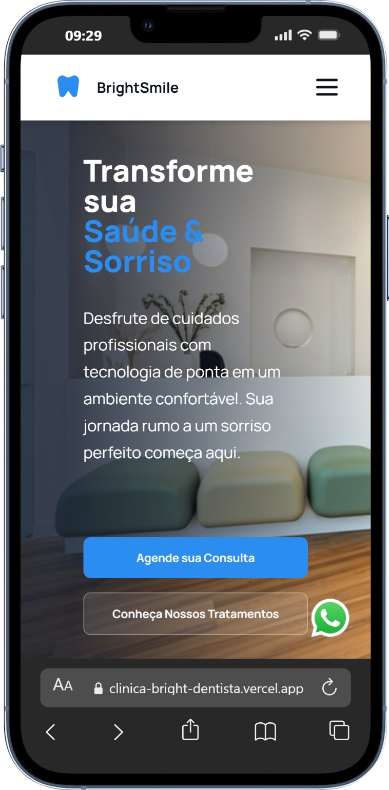

# 🦷 Clínica Bright Dentista

Site institucional desenvolvido com foco em estrutura semântica, responsividade e organização visual.

🔗 Deploy: https://clinica-bright-dentista.vercel.app/  
💻 Repositório: https://github.com/misael-sgomes/clinica-bright-dentista  

---

## 📌 Objetivo

Criar uma página institucional moderna para apresentação de serviços odontológicos, com navegação clara e layout responsivo.

---

## 🛠️ Tecnologias Utilizadas

- HTML5
- CSS3
- JavaScript
- Git e GitHub

---

## 🚀 Funcionalidades

- Layout totalmente responsivo
- Estrutura semântica em HTML
- Organização clara de seções
- Navegação intuitiva
- Código estruturado e versionado

---

## 📚 Aprendizados

- Estruturação semântica de páginas HTML
- Aplicação de responsividade com CSS
- Organização de código front-end
- Versionamento com Git

---

## 📷 Preview

  
  

